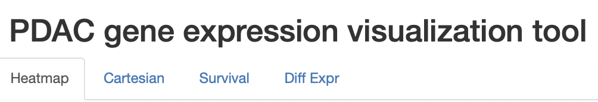
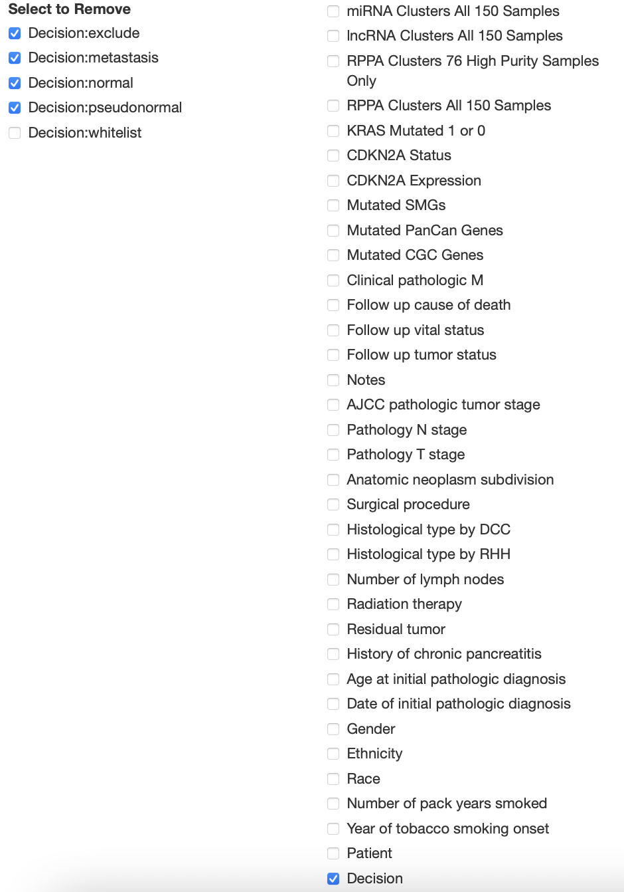
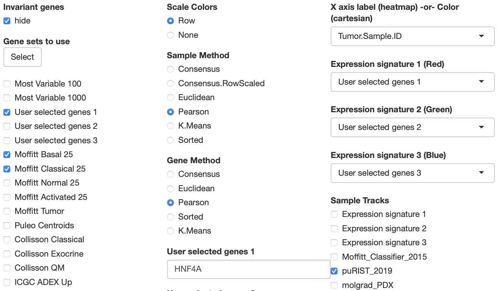
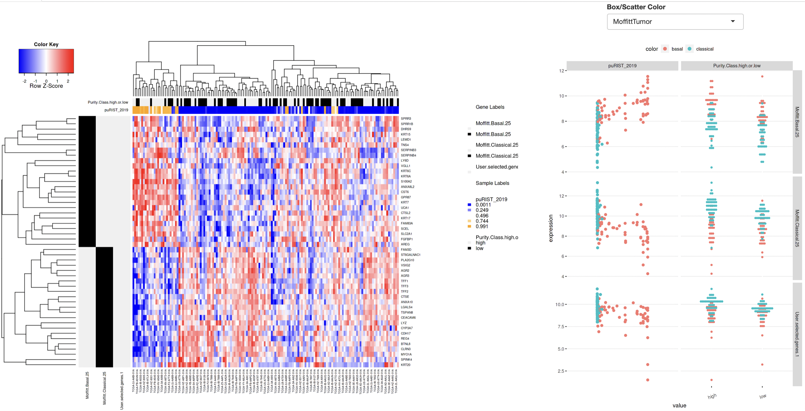
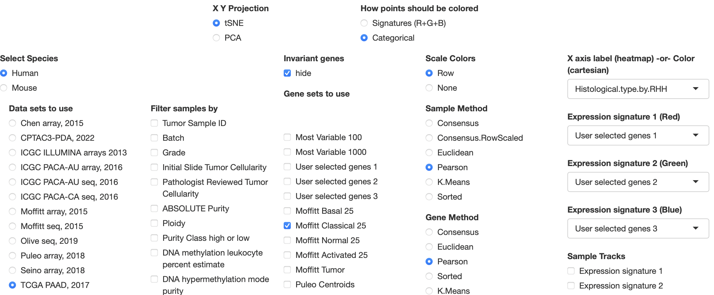
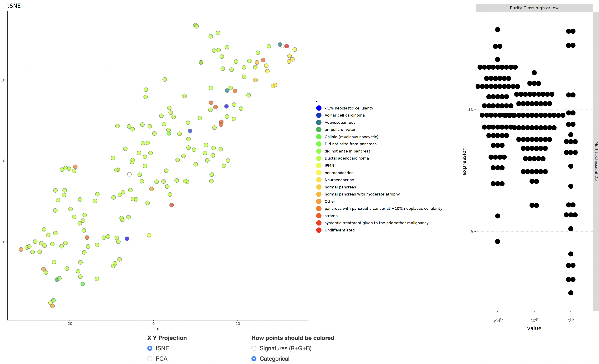
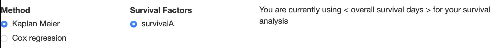
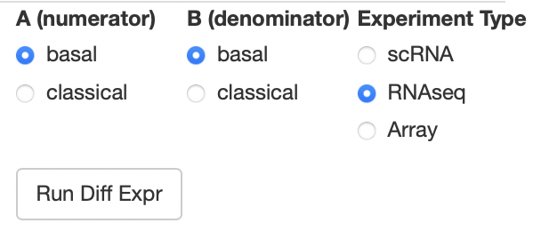
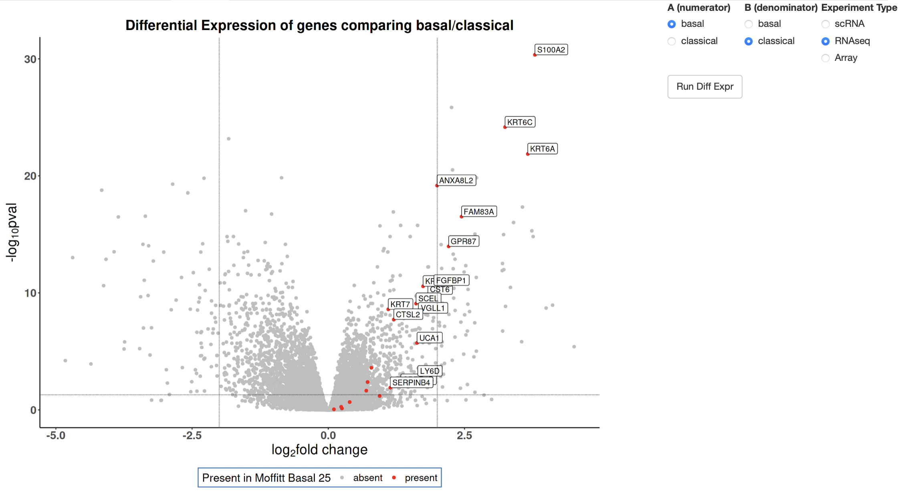

# pdacR

[](https://doi.org/10.5281/zenodo.7383375)

Find our webtool live [here!](http://pdacR.bmi.stonybrook.edu)

## Repository layout

* Data/ holds all parsed datasets, as well as the gene signatures object and PurIST classifier object. These datasets are used both in the app and in the [associated publication Torre-Healy et al. 2023](https://www.nature.com/articles/s42003-023-04461-6).
* R/ holds all wrapper functions used in the application
* inst/analysis holds all preliminary analytical files and will hold a singular file used for generation of paper figures
* inst/shiny holds the code for execution of the app (and a similar version called webApp used for web-based dataset loading)
* man/, as in all R packages, holds help files called using ?function

## Installing the package

To install the package, simply run
```
devtools::install_github("rmoffitt/pdacR")
```
Please note, there are quite a few datasets and substantial raw data within this package, so installation may take some time. Once installed, you can open the app using the function `pdacShiny()`

## Using the RShiny app (works for both local and web instances)

To host a local instance of the app, run `pdacR::pdacShiny()`
To use a web instance, navigate to http://pdacr.bmi.stonybrook.edu/pdac

### The Big Buttons

When you load the app, you will first see 4 tabs across the top:



Each of the 4 tabs uses the same 5 main options (dataset, filter, geneset, manual genes/cluster method, sample tracks) from the columns below, and are detailed at length in the following sections. 

### Persistent Options

#### Dataset selection

The leftmost column is a series of radio buttons of parsed and read-to-analyze publicly-available datasets. You can only select one at a time, but loading between the sets will be quick to facilitate serialized analysis. When you select a dataset, some metadata including accession and citation will appear beneath the list of datasets. The options beneath "Filter samples by" (column 2) and "Sample tracks" (column 5) will update accordingly to the sample-level information from each dataset.

#### Filtering your dataset 

Once you've selected a checkbox under the heading "Filter samples by", options will appear beneath the "load new dataset" textbox in the bottom left of the screen. Checking a box in this list will remove all samples with that label from all analyses. This is important to do to ensure accruate analyses. For example, TCGA-PAAD has 182 samples, but only 150 are PDAC. The remainder have been identified to be non-PDAC tumors in previous publications. To filter to the correct 150, select "Decision", and then remove all variables except "whitelist". Your selection should look as it does in the image below:



#### Picking your genes

To visualize gene expression, first select your gene sets of interest from the 'gene sets to use' column. You can manually add genes using the "User selected genes" text boxes to the right. You can input multiple genes separated by commas or spaces, and they will be treated as one "set". Be sure to click the correct "user selected genes" checkbox in "gene sets to use" to include your signature! These gene sets can be used heatmapping, visualizing correlations, performing dimensionality reduction, and coloring differential expression plots.

### Heatmapping and Clustering

After picking your dataset and genes of interest, click the "Generate Heatmap" button to generate the heatmap. You will see that all non-selected genesets disappear, and a heatmap is generated consisting of selected genes. Genes that belong to a particular gene set will be indicated with a black bar to the left of the heatmap. Once you have generated the heatmap, you can deselect certain sets by unchecking the relevant check box. Doing so will remove genes that are unique to that set from the heatmap. This is helpful if you want to look at only the overlap of two gene sets, without cluttering your visualization. 



#### Adding Sample Tracks

You can add sample information to the top of the heatmap for improved visualization by using the "Sample Tracks" (column 5) select boxes. These tracks will also be used to generate either dot plots (categorical x continuous) or scatter plots (continuous x continuous) to the right of the heatmap comparing their values to the expression of your selected genesets. 

When you're finished, click "Select" under "Gene sets to use" and your heatmap will be generated.



### Cartesian

Cartesian plotting primarily uses columns 4 and 5, in addition to two new selection options. At the top of the existing 5 columns, "X Y Projection" and "How points should be colored" will help you generate cartesian plots with ease. 



To alter categorical coloration by sample info, use the "X-axis label -or- Color" dropbox at the top of column 5. Be careful picking something like "ID", as generating individual colors for each dot can slow down the interface. We recommend selecting this BEFORE navigating to the Cartesian tab.

To generate a signature for coloration, use the "Expression Signature" dropdown menus on the right of the GUI. These will default to the user selected genes, but can be changed to any of our curated gene lists.



### Survival

The survival tab features two new options that appear at the top of the selection columns, "Method" and "Survival Factors".



First, choose your method of analysis from the "Method" column on the left-most side of the GUI. Then, if your data has more than one survival metric, select which you will use from "Survival Factors."

To perform survival analysis, you will then use the right-most column labeled "Sample Tracks". You may check up to two boxes, and the GUI will separate your plots by how they intersect. If the factor you choose is numeric, a slider bar will appear in the top right of the GUI. Use this bar to quantile your data. Warning! Avoid extremes, as you will weaken your sample size.

To see the impact a gene or geneset has on survival, select them in the "Expression signature" dropdown menus and select the corresponding checkbox under "Sample Tracks."

At this time, the app can handle up to two sample tracks at once for survival analyses. In Kaplan-Meier analysis, a single plot will be generated with each combination of terms from both sample tracks. If you select Cox Regression, one plot will be made per sample track.

### Differential Expression (DE)

To perform DE, you must pick 1 gene set and 1 "Sample Track". In the top right corner, radio buttons will appear so you may pick your comparison (multivariate comparisons will be provided in a future release). Our provided data sets already select the appropriate method of DE analysis based on the mode of experimentation. You may select your own in "Experiment Type" before clicking the "Run Diff Expr" button. The experiment types are described here:
* scRNA: If you select "scRNA", a simple t-statistic will be generated between cohorts. This is only used in the interest of rapid point-and-click analysis, and we recommend validating the findings using more robust techniques.
* RNAseq: This selection implements DESeq2 methodology on the subset of the data selected to generate an A vs B log fold change and -log10(padj) volcano plot
* Array: This selection implements limma and extracts the logFC and padj columns to generate a similar volcano plot to DESeq2.



Dots colored red are members of the geneset you selected (multiple gene set coloration will be provided in a future release). If members of your gene set are significantly differently expressed (regardless of log fold change), they will be labeled on the volcano plot as shown below.



## Building the package

If you would like to make your own edits to the application locally, first clone the repo using:

```
git clone https://github.com/rmoffitt/pdacR.git
```

Then install dependencies using `install.dependencies.R` in the `R` directory.
The package should then be able to be built using your favorite build method.

From command line, in the directory containing your cloned repo:
```
R CMD build pdacR
```
Or using the RStudio build pane as explained [here](https://support.rstudio.com/hc/en-us/articles/200486488-Developing-Packages-with-RStudio).

Parsed datasets can be found in the `data` directory, with corresponding raw data in `inst/extdata`

## Loading New Data (LOCAL ONLY)

In order to load data into the package, the data sets must be part of an installed package on the user's R instance. Under "Data sets to use" in the left-most column, you will see a text entry box labeled "Add private data". Below, we detail how to appropriately format your data files for ease of loading

### GUI Data structure

The preferred format for data input is an object of class _list_ containing four named objects:
* $ex: Can be a _matrix_ or _data.frame_ with each column representing a sample and each row representing a gene
* $sampInfo: A _data.frame_ with each row corresponding to a sample (it is important that column _n_ in $ex and row _n_ in $sampInfo refer to the same sample!)
* $featInfo: A _data.frame_ with each row corresponding to a row in $ex (it is important that row _g_ in $ex and row _g_ in $featInfo refer to the same gene! The minimum required column is SYMBOL for gene names (eg: KRT17, TFF2)
* $metadata: A _list_ that tells the application about the status of the expression data. log.transformed is a boolean that tells the application if the data has already been transformed to prevent over normalization

Note: This structure is very similar to the `SummarizedExperiment` class. We have provided a helper function {`R/Convert_GUI_data.R`} to facilitate appropriate formatting. 
For examples, please refer to some of the included sample .RData objects in `data/`

### Package Formatting

Private data packages _**must have been built and installed**_ to their local instance before being uploaded to the GUI. **Loading a package will append all private data sets and private gene lists to selectable menus.** To do so, PackageName/data/ must contain _at least one_ of the following objects:
* data_set_list.RData: a _data.frame_ with columns _labels_ (how the data will appear) and _variablenames_ (the name of the saved .rds object as it would be loaded in memory). Each .rds object should match the format detailed above
* gene_set_list.RData: A _list_ of character vectors. The name of each entry in the list will be appended to our select gene sets column. **Note: These currently only integrate well as gene SYMBOL, if you use Entrez or ensembl IDs, they will not be comparable across our public data sets or in conjunction with our gene sets**
* Any .rds you'd like to load in, using the above _list_ format

## Contributions

We welcome community investigators to issue pull requests or open issues to help improve the functionality of this tool for PDAC data centralization and ease of use.
Inquiries can be sent to richard.moffitt @ stonybrookmedicine.edu

## More information
More information on pdacR and its Shiny app can be found here:

```
< Publication link here >
```

Analyses relevant to the paper are located in `inst/analysis`

For gene set information, please see `R/parse_gene_lists.R`. This script has the relevant citations and the locations of the relevant raw files within `inst/extdata`. 

## License

All source code in this repository, with extensions `.R` and `.Rmd`, is available under an MIT license. All are welcome to use and repurpose this code.

**The MIT License (MIT)**

Copyright (c) 2016 Richard A. Moffitt

Permission is hereby granted, free of charge, to any person obtaining a copy of this software and associated documentation files (the "Software"), to deal in the Software without restriction, including without limitation the rights to use, copy, modify, merge, publish, distribute, sublicense, and/or sell copies of the Software, and to permit persons to whom the Software is furnished to do so, subject to the following conditions:

The above copyright notice and this permission notice shall be included in all copies or substantial portions of the Software.

THE SOFTWARE IS PROVIDED "AS IS", WITHOUT WARRANTY OF ANY KIND, EXPRESS OR IMPLIED, INCLUDING BUT NOT LIMITED TO THE WARRANTIES OF MERCHANTABILITY, FITNESS FOR A PARTICULAR PURPOSE AND NONINFRINGEMENT. IN NO EVENT SHALL THE AUTHORS OR COPYRIGHT HOLDERS BE LIABLE FOR ANY CLAIM, DAMAGES OR OTHER LIABILITY, WHETHER IN AN ACTION OF CONTRACT, TORT OR OTHERWISE, ARISING FROM, OUT OF OR IN CONNECTION WITH THE SOFTWARE OR THE USE OR OTHER DEALINGS IN THE SOFTWARE.
